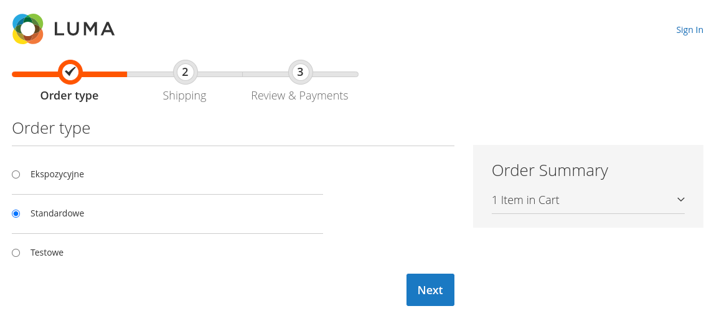
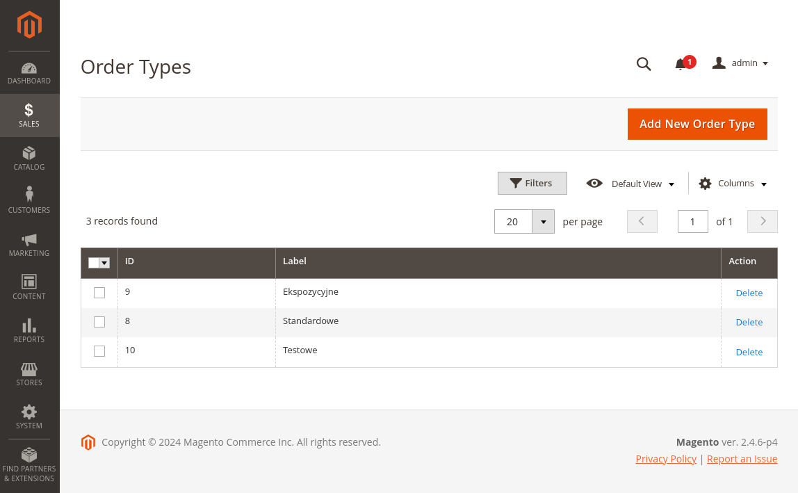
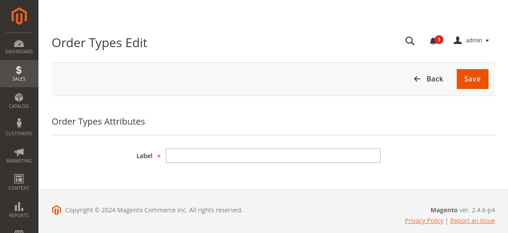

# Moduł Checkout v1.0.0

Moduł rozszerza checkout o możliwości wybrania typu zamówienia

Dostępne typy zamówienia dostepne są w panelu admina w Menu Sales -> Order Type Options

Możliwe jest dodawanie nowych wpisów (przycisk Add New Order Type)

Możliwe jest równie usuwanie wpisów (akcja delete w tabeli)

W formularzu nowej opcji wystarczy zdefiniować nazwę nowego typu zamówienia

